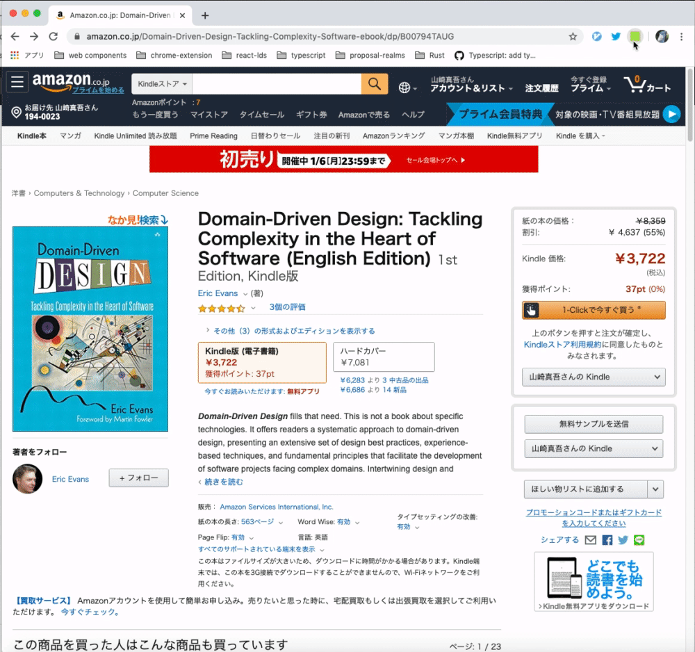

Amazon to kintone
=================

## Building

1.  Clone repo
2.  `npm install`
3.  `npm run build` to compile once or `npm run watch` to run the build task in watch mode

## Installation

### 1. From Chrome WebStore

https://chrome.google.com/webstore/detail/amazon-to-kintone/leipfhjipgnfbdjkbinlmlmfdhgcakki

### 2. Install from repository (unpacked extension):

1.  Complete the steps to build the project above
2.  Go to [_chrome://extensions_](chrome://extensions) in Google Chrome
3.  With the developer mode checkbox ticked, click **Load unpacked extension...** and select the _dist_ folder from this repo
